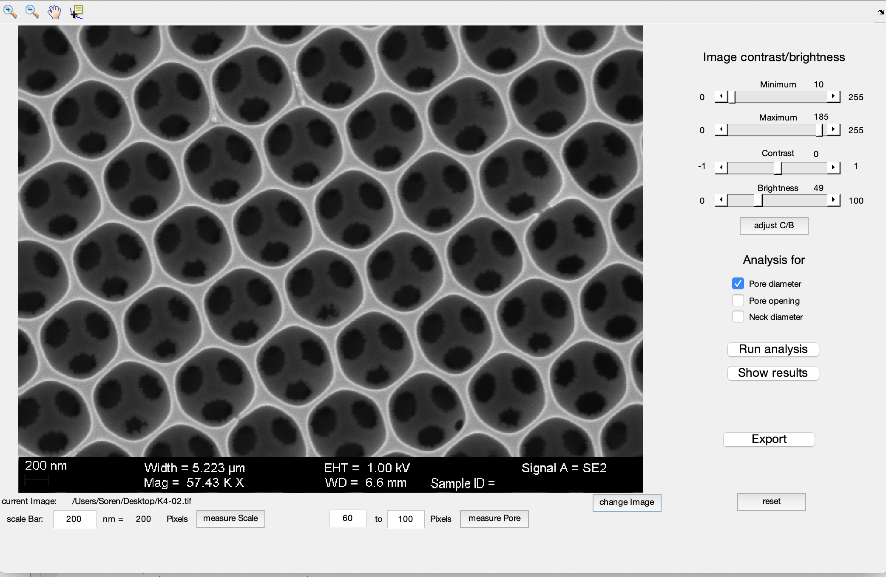
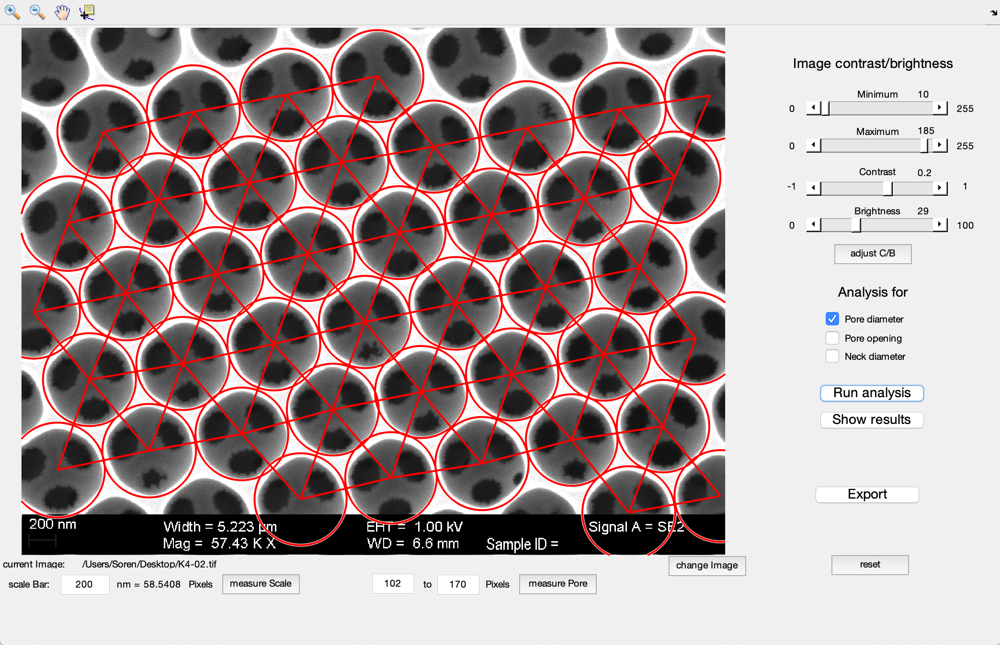
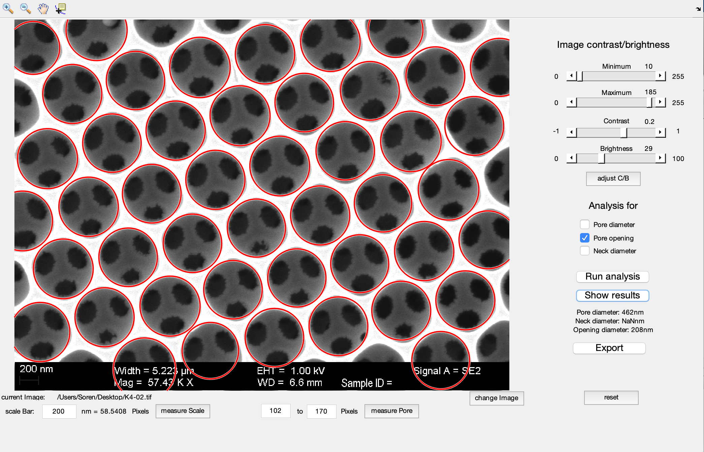
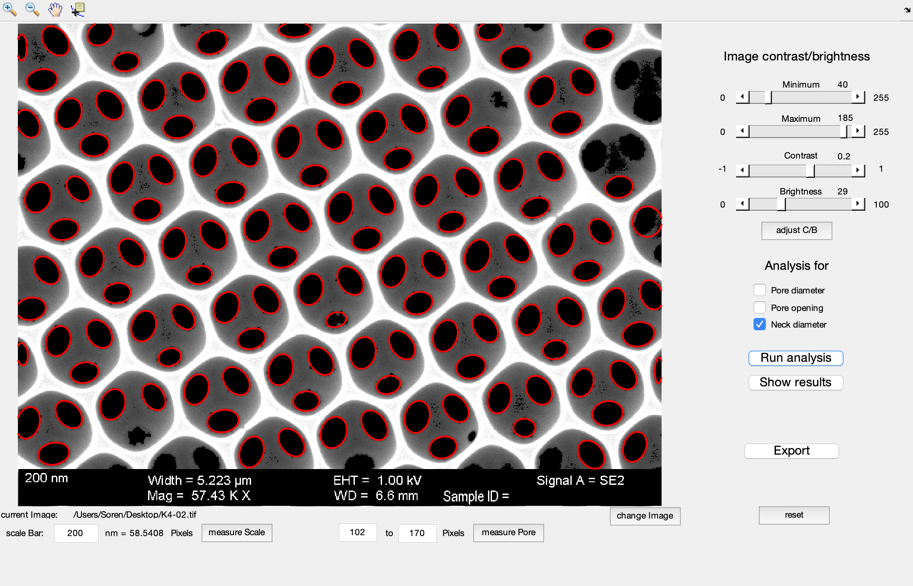

# Inverse-Opal-Film-analysis
Simple Matlab GUI to analyze inverse opal films

#### Requirements:
- matlab (originally written in 2018a)
- image_toolbox
- statistics_toolbox

#### Installation:
IOFpore_neck_analysis.m and IOFpore_neck_analysis.fig must be placed in the same directory. When running IOFpore_neck_analysis.m, the GUI is displayed using the outline in IOFpore_neck_analysis.fig.

To install: 
```shell 
git close https://github.com/soerenbrandt/Inverse-Opal-Film-analysis.git
pip install ./Inverse-Opal-Film-analysis
```

To remove: 
```shell
pip remove Inverse-Opal-Film-analysis
```

#### Application:
Inverse-Opal-Film-analysis is a tool to analyze the pores in inverse opals, which are close-packed porous films. The analysis involves three features that find the size of the pores (assuming an face-center-cubic packing), their interconnecting necks, and the size of the openings of the top layer (see tutorial). The pores and openings are found using Hough transforms while the necks are located using image thresholding.

#### Tutorial:
1. When running IOFpore_neck_analysis.m, an image can be loaded using the prompted dialog. Else, an image can also be selected using the change image field in the GUI.


2. Measure and adjust the scale bar and roughly measure the size of the pore-to-pore center using the handles underneath the image on the bottom left.
3. Measure the important dimensions of the inverse opal film by: 
    - adjusting the image properties using the sliders on the top right,
    - selecting the appropriate measurement (pore, opening, neck),
    - and selecting the *Run*-button
4. The results can be saved as a .txt-file of the dimensions by selecting *Export Results*
  
